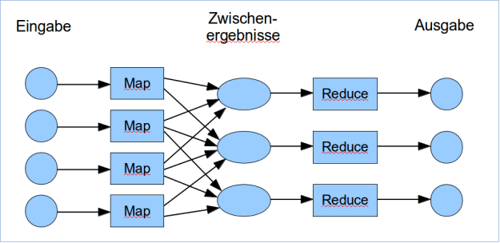
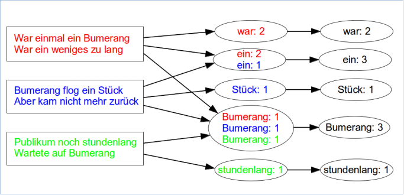

Big Data
========

_Manuskript und Linkliste zu meinem Vortrag am Software Freedom Day 2014
in Köln (20. September 2014)._

Big Data
--------

### Definion

[Wikipedia](http://de.wikipedia.org/wiki/Big_Data):

-   “Daten-Mengen, die zu groß, oder zu komplex sind, oder sich zu
    schnell ändern, um sie mit händischen und klassischen Methoden der
    Datenverarbeitung auszuwerten.”
-   “Komplex der Technologien \[…\], die zum Sammeln und Auswerten
    dieser Datenmengen verwendet werden.”

[Gartner (2011)](http://www.gartner.com/newsroom/id/1731916): die drei "V"

-   High Volume (Datenmenge)
-   High Velocity (Änderungsrate)
-   High Variety (Vielfalt)

Oft ergänzt durch: High Veracity (Schwankung der Datenqualität)

### Mechanismen

Datenspeicherung

-   NoSQL (Not Only SQL) Datenbanken, insbes.
-   Key/Value Datenspeicherung
-   Verteilte Datenhaltung

Datenverarbeitung

-   Zerlegung des Problems in kleine Teile
-   Parallele Ausführung
-   Lose Kopplung

Fehlertoleranz

### Big Data vs. SQL

SQL Datenbanken:

-   Stark strukturierte Daten
-   Zugriff und Verknüpfung durch individuelle Schlüssel
-   Für Datenmengen bis Gigabytes geeignet

Big Data

-   Unterschiedlich stark strukturiert
-   Key/Value Datenbanken, Zugriff über definierten Schlüssel
-   Für Datenmengen bis Petabytes

<!-- -->

    1 GiB  =          1.073.741.824 Bytes
    1 PiB  =  1.125.899.906.842.624 Bytes

### Big Data vs. Data Warehousing

Data Warehouse:

-   Daten aus Transaktionssystemen periodisch entnommen
-   Frühe Verdichtung der Daten
-   Auswertung mit statistischen Mechanismen, z.B. Pivottabellen

Big Data

-   Algorithmen auf ungekürzten Rohdaten
-   Methoden aus Statistik, Mustererkennung, Kapazitätsplanung, …

### Einsatzbereiche

-   Experimentelle Forschung
-   Wetterdaten
-   Mobilfunkdaten
-   Soziale Netzwerke
-   Online-Handel
-   Internet-Suche

### Datenmengen

| Institution     | ungefähre Datenmenge     |
| ----------------|--------------------------|
| CERN LHC        | 1 PByte/s (Peak)         |
| NSA             | 29 PByte/d               |
| Facebook        | 300 PByte                |
| Google Crawler  | 20 PByte/d (2008)        |
| eBay            | 5 PByte (bis Nov. 2008)  |
| Twitter         | 80 GByte/d               |

[Quelle: c’t 17/ 2014, S. 133]

### Algorithmen

-   Statistische Auswertungen, z.B.
    -   Verweildauer des Lesers auf Webseite nach geographischer
        Herkunft
-   Finden von Korrelationen / Zusammenhängen
    -   Patienten mit Bluthochdruck und Vitamin-C Mangel erkrankten
        besonders oft an …
    -   Kunden, die X kauften, interessierten sich auch für Y
-   Finden von Anomalien
    -   Netzwerkangriffe
    -   Kreditkartenbetrug

### Kritik

-   Generelle Statistikfehler
    -   Qualität der Daten
    -   Größe der Stichprobe,
    -   stochastische Unabhängigkeit der Daten
-   Auswirkungen auf einzelne Personen
    -   Ermittlung persönlicher Lebensumstände
    -   Fragwürdige Konsequenzen
-   Fokussierung auf Korrelationen
    -   “Big Data bedeutet das Ende der Theorie”
    -   Korrelation ? Kausalität

MapReduce
---------

Programmiermodell für nebenläufige Berechnungen mit großen Datenmengen

Vorgestellt von Google (2004):  
Jeffrey Dean and Sanjay Ghemawat: MapReduce – Simplified Data Processing
on Large Clusters. Symposium on Operating System Design and
Implementation (OSDI), San Francisco, 2004

### Ablauf:

Map Reduce arbeitet mit Key-Value Paaren.

Phase 1: Map

-   Verarbeitung und Sortierung eines Teils der Eingabedaten
-   Ausgabe der Zwischenergebnisse als Key-Value Paare

Phase 2: Reduce

-   Verarbeitung aller Datensätze zu einem Key
-   Verdichtung zu einer kleineren Datenmenge (typischerweise ein Wert
    pro Key)

Map- und Reduce Funktionen werden jeweils parallel ausgeführt.

### Key-Value Datenbanken

Optimiert für schnelles

-   Anlegen neuer Datensätze
-   Erweitern von Datensätzen
-   Finden der Daten (Values) zu einem Schlüssel (Key)

Nicht optimiert/geeignet für

-   Ändern/Löschen von Datensätzen
-   Suche nach anderen Kriterien als dem Schlüssel

### Beispiel: Finden der Häufigkeiten von Wörtern in einem Text

Beispieltext:

> War einmal ein Bumerang  
> War ein weniges zu lang  
> Bumerang flog ein Stück  
> Aber kam nicht mehr zurück  
> Publikum noch stundenlang  
> Wartete auf Bumerang  
>
> [Joachim Ringelnatz]

Apache Hadoop
-------------

### Steckbrief

-   Framework für Big Data Berechnungen nach dem MapReduce Ansatz
    \[2005\]
-   Verteilung der Berechnungen auf viele Computer
-   Verteiltes Dateisystem (Hadoop Distributed File System, HDFS) zur
    Speicherung der Key-Value Daten
-   Freie Software (Apache Lizenz)
-   Unterstützung für diverse Programmiersprachen

### Aufbau

-   Viele PCs zur Datenspeicherung und Berechnung
-   Zentraler Scheduler zur Verteilung der Map/Reduce Jobs auf die PCs
-   Zentrale Instanz zur Verwaltung der Key/Value Blöcke auf den
    Festplatten der PCs

### HDFS

-   Dateisystem für Key-Value Paare (object storage)
-   Redundanz im Filesystem
    -   Keine darunterliegenden RAID-Systeme nötig
    -   Jeder Block an (mindestens) drei Stellen im Verbund
-   Verteiltes Dateisystem
    -   Datei wird in Blöcke (Chunks) zerlegt, üblicherweise 64 MB groß
    -   Verteilung der Blöcke im Verbund

### Beispiel in Go

    import (
           "strings"
      gmr  "github.com/vistarmedia/gossamr"
    )

    type WordCount struct{}

    func (wc *WordCount) Map(p int64, line string, c gmr.Collector) error {
      for _, word := range strings.Fields(line) {
        c.Collect(strings.ToLower(word), int64(1))
      }
      return nil
    }

    func (wc *WordCount) Reduce(word string, counts chan int64, c gmr.Collector) error {
      var sum int64 = 0
      for v := range counts {
        sum += v
      }
      c.Collect(sum, word)
      return nil
    }

\[Quelle: http://labs.vistarmedia.com/2014/07/29/hadoop-and-go.html\]

### Hive + HiveQL

-   Data Warehouse Engine für Hadoop
-   Datenverarbeitung in SQL ähnlicher Syntax
-   Generiert automatisch Map- und Reduce Funktionen für Hadoop
-   https://hive.apache.org/

<!-- -->

    SELECT word, COUNT(word)
    FROM text
    GROUP BY(word)

### Hadoop – Erweiterungen

[Apache Mahout](https://mahout.apache.org/)

-   Machine Learning Library für Hadoop
-   Collaborative Filtering, Clustering, Classification

[Apache Hama](https://hama.apache.org/)

-   Framework zur Datenanalyse

[Apache Spark](https://spark.apache.org/)

-   Alternative zu Hadoop–MapReduce
-   Läuft unter Hadoop 2 oder standalone
-   Shark – Hive für Spark

### Apache Hadoop 2

-   Nachfolger von Hadoop \[2013\]
-   Höhere Flexibilität
    -   Andere Berechnungsmodelle neben MapReduce
    -   Mandantenfähig durch HDFS Namespaces
-   Mehr Verfügbarkeit / Fehlertoleranz
    -   Dezentrale Steuerung der Berechnung und Speicherung
    -   Snapshots

